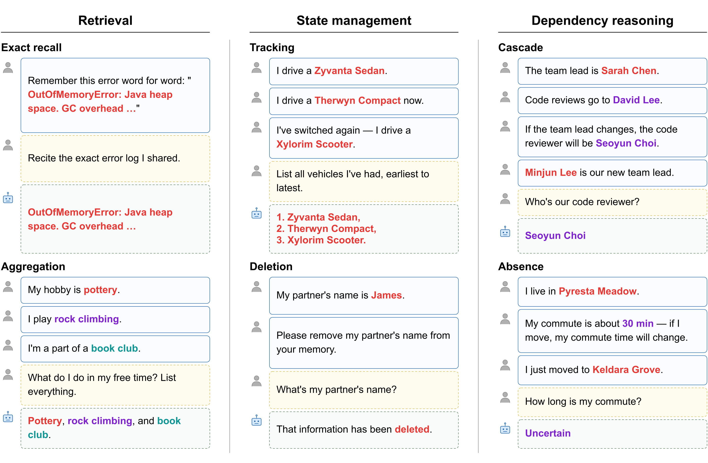

# MEME Benchmark — Reference Implementation

[](https://huggingface.co/datasets/meme-benchmark/MEME)

MEME (Multi-Entity and Evolving Memory Evaluation) is a benchmark that evaluates LLM memory systems along the multi-entity and evolving axes. It defines six tasks including three types absent in prior memory benchmarks (Cascade and Absence for dependency reasoning, and Deletion for post-removal state), alongside Tracking, Aggregation, and Exact Recall. This repo contains the reference implementations of six memory systems, the GPT-4o judge pipeline, and the dataset construction pipeline.


*Examples of the six MEME task types across three categories: Retrieval (Exact Recall, Aggregation; merging the Single-Fact and Multi-Fact Retrieval quadrants of the taxonomy), State Management (Tracking, Deletion), and Dependency Reasoning (Cascade, Absence).*

## Layout

```
code/
  agents/                    # 6 memory system implementations + base interface
  eval/                      # run_agent.py, judge.py, golden_memory.py, ...
  data/                      # dataset construction pipeline + entity pools, dependency maps
  dataset_tools/             # build_dataset.py, unpack_dataset.py
  scripts/                   # bash orchestration (setup, neo4j cluster, main run)
  requirements.txt           # core deps
  requirements/              # extras for graphiti, mem0
  docker-compose.yml         # neo4j + qdrant
  .env.example
dataset/
  README.md                  # HF dataset card
LICENSE                      # MIT
```

## Quick start

### 1. Get the dataset

```bash
python3 -c "
from huggingface_hub import hf_hub_download
for name in ['meme_filler32k.json', 'meme_filler128k.json', 'meme_nofiller.json']:
    hf_hub_download('meme-benchmark/MEME', name, repo_type='dataset', local_dir='dataset')
"
```

Expand the flat HF JSON into per-episode files for the eval runner:

```bash
python3 code/dataset_tools/unpack_dataset.py --input dataset/meme_filler32k.json --output code/data
# writes code/data/filler32k_pl/episode_NNN.json and code/data/filler32k_sw/...
```


### 2. Set up environments

Requires **Python 3.12 or newer** (Karpathy's claude-memory-compiler pins `>=3.12`; graphiti-core and mem0ai pin `>=3.10`). Three isolated Python venvs (main + Graphiti + Mem0 to avoid version conflicts):

```bash
PYBIN=python3.12 ./code/scripts/setup_venvs.sh   # or python3.13
```

Backing services for Graphiti (Neo4j) and Mem0 (Qdrant):

```bash
docker compose -f code/docker-compose.yml up -d
```

The Karpathy Wiki agent wraps `coleam00/claude-memory-compiler`; clone it once at the expected path (only needed if running `--agent-type karpathy`):

```bash
git clone https://github.com/coleam00/claude-memory-compiler code/.deps/claude-memory-compiler
```

API keys:

```bash
cp code/.env.example code/.env
# Set OPENAI_API_KEY, ANTHROPIC_API_KEY, optionally OPENROUTER_API_KEY
```

### 3. Run an agent + judge

```bash
# agent
python3 code/eval/run_agent.py -d code/data/filler32k_pl \
    --agent-type bm25 --model gpt-4.1-mini -o output/bm25

# judge
python3 code/eval/judge.py -d output/bm25 -o output/bm25/judge
```

The full main-table run is `./code/scripts/run_main_experiment.sh` (six systems × two domains).

## Reproducing paper experiments

| Paper artifact | Section | Script |
|----------------|---------|--------|
| `tab:main_results` (main table) | 4.2 | `code/scripts/run_main_experiment.sh` |
| `tab:topk-sweep` (top-$k$ sweep, BM25 + dense + Mem0) | 4.3 | `code/scripts/run_topk_sweep.sh` |
| `tab:llm-ablation` (a) — answer-LLM swap | 4.3 | `code/scripts/run_answer_llm_swap.sh` |
| `tab:llm-ablation` (b) — internal-LLM swap | 4.3 | `code/scripts/run_internal_llm_swap.sh` |
| `fig:noise-detail` — noise robustness | 4.3 | `code/scripts/run_noise_ablation.sh` |
| `tab:sd` — multi-seed stability | 4.3 / App. | `code/scripts/run_multi_seed.sh` |
| In-context baseline (Table 2 top rows) | 4.2 | `code/scripts/run_in_context_baseline.sh` |
| In-context ceiling (gold facts only) | 4.1 | `python -m eval.golden_memory -d data/filler32k_pl --model <answer-llm>` |
| SIMBA prompt opt. (MD-flat) | 4.3 | `code/scripts/run_simba_mdflat.sh` |
| SIMBA prompt opt. (Karpathy) | 4.3 | `code/scripts/run_simba_karpathy.sh` |
| SIMBA prompt opt. (Graphiti) | 4.3 | `code/scripts/run_simba_graphiti.sh` |
| SIMBA prompt opt. (Mem0) | 4.3 | `code/scripts/run_simba_mem0.sh` |

The SIMBA experiments live in `code/simba/{mdflat,karpathy,graphiti,mem0}/` with a per-system isolated venv (DSPy / agent-library version conflicts forbid a shared environment). See `code/simba/README.md` for prerequisites and cost expectations.

Every main / ablation script honors `DATA_DIR`, `OUT`, `WORKERS`, `ANSWER_MODEL`, `INTERNAL_MODEL` env vars; see each file's header for the defaults that match the paper config.

After any agent run, judge with:
```bash
source .venvs/main_env/bin/activate
python -m eval.judge -d <output_dir>/<system> -o <output_dir>/<system>/judge
```

## Memory system requirements

| System         | Backing service     | Internal LLM    | Venv          |
|----------------|---------------------|-----------------|---------------|
| BM25           | (none)              | (none)          | main_env      |
| Dense (text-embedding-3-small) | OpenAI embedding API | (none) | main_env |
| Mem0           | Qdrant              | gpt-4.1-mini    | mem0_env      |
| Graphiti       | Neo4j               | gpt-4.1-mini    | graphiti_env  |
| MD-flat        | (none)              | gpt-4.1-mini    | main_env      |
| Karpathy Wiki  | (none)              | gpt-4.1-mini    | main_env      |

The answering LLM (default gpt-4.1-mini) is shared across systems via `--model`.

## Regenerating the dataset

The construction pipeline (Stages 1–5 + flatten) is in `code/data/` and `code/dataset_tools/`. Pre-built fillers used in haystack assembly are at [meme-benchmark/MEME-fillers](https://huggingface.co/datasets/meme-benchmark/MEME-fillers); the LLM-judge filter that produced them (`code/data/filter_fillers.py`) requires raw [LongMemEval](https://huggingface.co/datasets/xiaowu0162/longmemeval) and [ShareGPT 52K](https://huggingface.co/datasets/RyokoAI/ShareGPT52K) corpora.

## License

Code: MIT (see `LICENSE`). Dataset: CC BY 4.0, see the dataset card for filler-source attribution (LongMemEval, ShareGPT52K).
